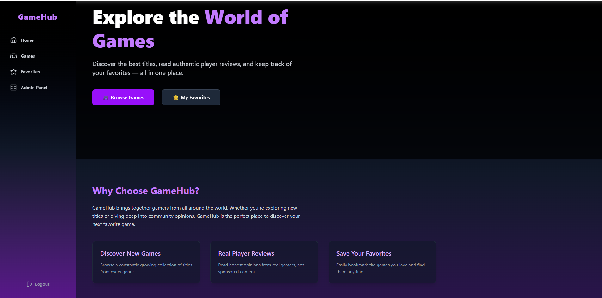
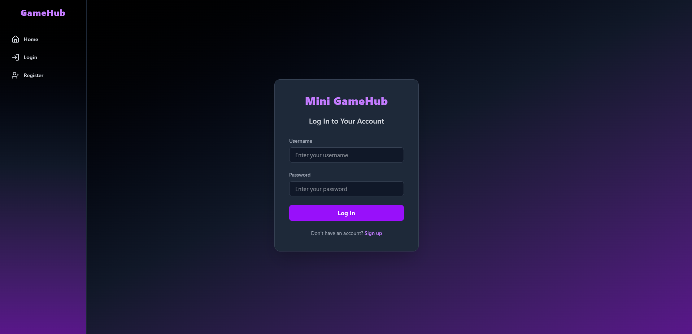
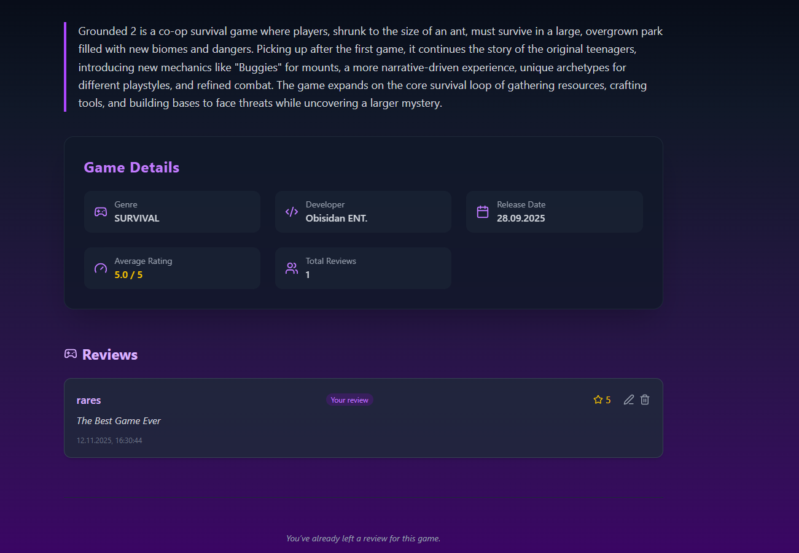
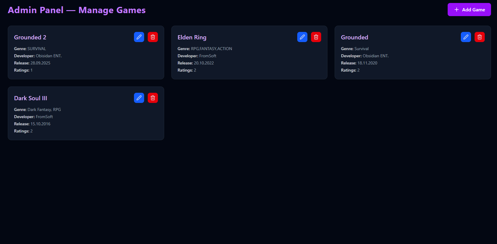
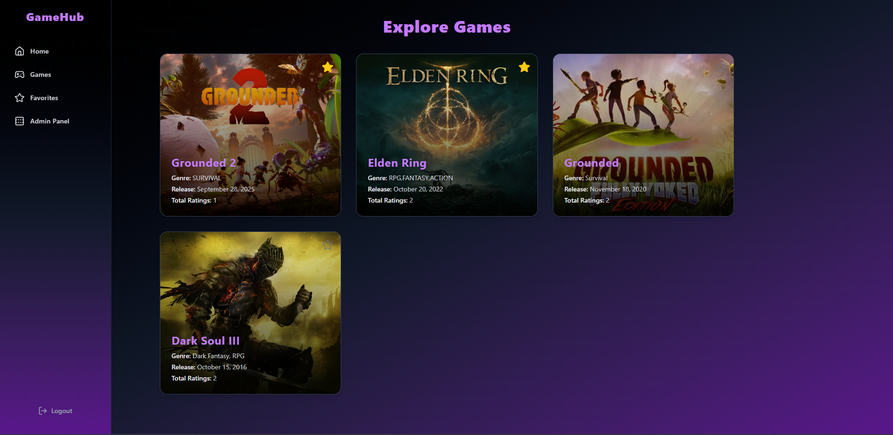

# Mini GameHub API

**GameHub** is a full-stack web app where users can explore, review, and rate video games.  
Built with **React** (frontend) and **Django REST Framework** (backend), it demonstrates clean architecture, caching, authentication, and CRUD operations.

---

## **Description**

This App allows:

- User management and authentication via JWT.
- Creating, listing, updating, and deleting games (with admin permissions for modifications).
- Adding reviews for games, with ratings and comments, limited to a single review per user per game.
- Adding games to a **"Favorite"** category (via toggle).
- Filtering, searching, and sorting games and reviews.
- Pagination for large results, optimizing performance.
- Caching system for faster response times using **Redis**.
- Automatic cache invalidation on game or favorite creation/deletion (via Django signals).
- Request throttling system to prevent abuse and ensure API stability.
- Full unit testing coverage for core endpoints (Games, Reviews).

---

## Tech Stack

**Frontend:** React 18, React Router, TailwindCSS  
**Backend:** Django 5, Django REST Framework, PostgreSQL  
**Caching:** Redis  
**Auth:** JWT (SimpleJWT)  
**Tools:** Docker, DRF Filters, Signals, Axios

## **Features**

- **Ordering:** Games and reviews can be ordered by relevant data (e.g., release date, average rating, number of reviews).
- **Filtering:** Support for filtering games and reviews by various criteria (genre, developer, rating, etc.).
- **Searching:** Text search in title and developer.
- **Pagination:** Limits the number of results per page for optimal performance.
- **Performance:** Optimizations using `select_related` and `prefetch_related` to reduce SQL queries.
- **Caching:** Game list results are cached for 15 minutes in Redis for faster performance.
- **Cache Invalidation:** Implemented via Django signals (post_save, post_delete) to ensure up-to-date data.
- **Throttling** Custom burst and sustained throttling policies:
  - `burst`: limits short-term rapid requests.
  - `sustained`: controls long-term request volume.
  - Implemented with DRF’s `UserRateThrottle` + Redis backend.
- **Testing** Comprehensive unit test coverage using Django REST Framework’s test suite.
- Tests include:
  - CRUD operations for Games and Reviews.
  - Permission logic for admins and users.
  - Business rules (e.g., one review per game).
  - Database state validation after create/update/delete.

---

## **Environment Variables**

| Key             | Description                           |
| --------------- | ------------------------------------- |
| `SECRET_KEY`    | Django secret key                     |
| `DEBUG`         | Debug mode (True/False)               |
| `DB_NAME`       | PostgreSQL database name              |
| `DB_USER`       | PostgreSQL username                   |
| `DB_PASSWORD`   | PostgreSQL password                   |
| `DB_HOST`       | Database host                         |
| `DB_PORT`       | Database port                         |
| `ALLOWED_HOSTS` | Comma-separated list of allowed hosts |

---

## App Preview

| Page                      | Screenshot                                                         |
| ------------------------- | ------------------------------------------------------------------ |
| **Home**                  |         |
| **Login**                 |     |
| **Single Game + Reviews** |  |
| **Admin Panel**           |       |
| **Games List**            |         |

---

## **Setup & Run Locally**

```bash
# --- For the Back End ---

# 1 Clone the repository
git clone https://github.com/yourusername/GameHub-API.git
cd GameHub-API

# 2 Create a virtual environment
python -m venv venv
source venv/bin/activate    # on Linux/Mac
venv\Scripts\activate       # on Windows

# 3 Install dependencies
pip install -r requirements.txt

# 4 Run migrations
python manage.py migrate

# 5 Start Redis (if using Docker)
docker run -p 6379:6379 redis

# 6 Run the development server
python manage.py runserver


# --- For the Front End ---
cd frontend
npm install
npm run dev
```
